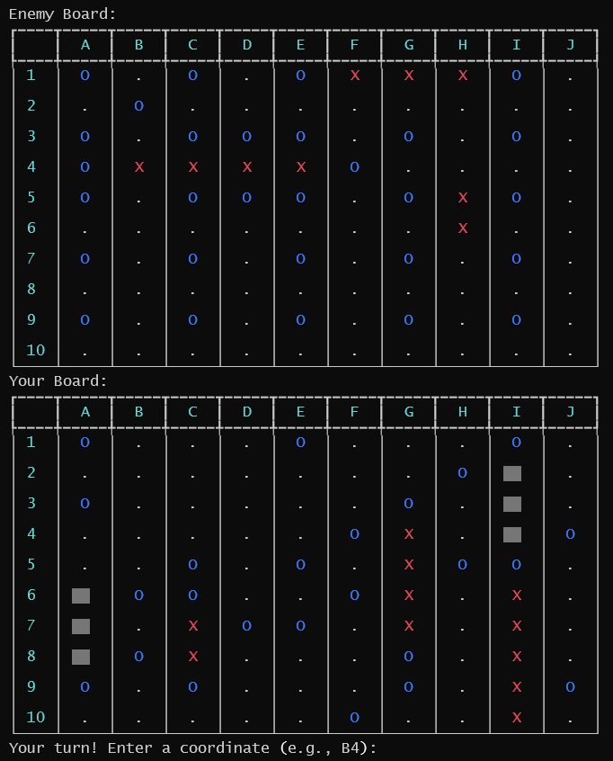

# TUI Battleship

## Quick Info
- Python Battleship game
- Play against AI
- 10x10 grid
- Ships: Carrier, Battleship, Cruiser, Submarine, Destroyer

## Requirements
- Python 3.x
- Modules: rich, art
  - Install with: pip install rich art

## Running the Game
- Command: python battleship_game.py

## Gameplay
- Place ships: manual/auto
- Attack by entering coordinates (e.g., A1)
- Win: sink all AI ships

## Features
- Console-based UI
- Enhanced with rich and art
- Intelligent AI
- Debug mode for insights

## Enjoy!
- Test your strategy
- Outsmart the AI
- Fun and engaging
